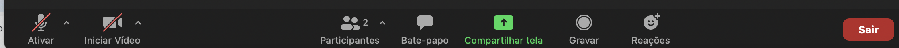
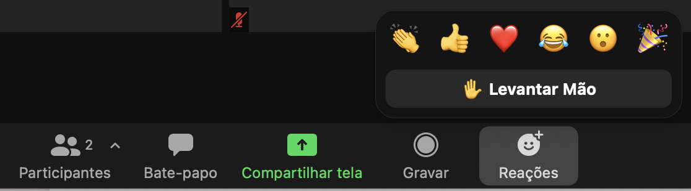
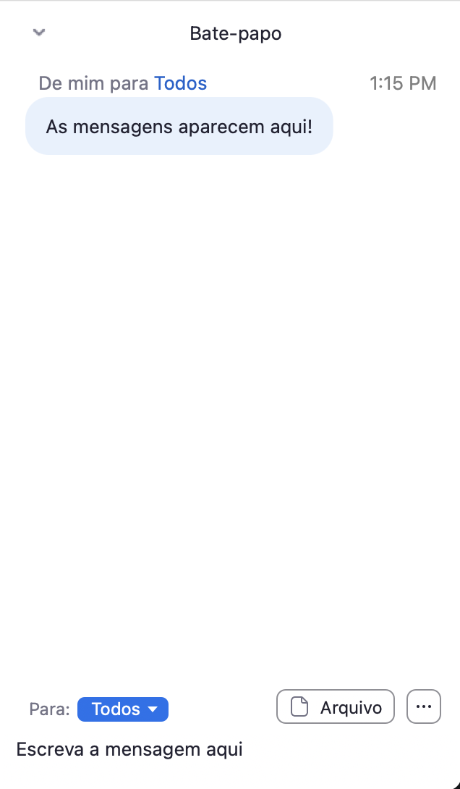

```{r setup, include=FALSE}
options(htmltools.dir.version = FALSE)
```

class: middle, center

# Sobre a Curso-R

---


class: middle, center

## A empresa

.pull-left[
```{r, echo = FALSE}
knitr::include_graphics("https://d33wubrfki0l68.cloudfront.net/295643c6243701ae6a9bac3fb8ad467ff0ce3c84/d1785/img/logo/cursor1-41.png")
```

<br>
<br>

```{r, echo = FALSE}
knitr::include_graphics("img/logo_r6.png")
```

]

.pull-right[
```{r, echo = FALSE}
knitr::include_graphics("img/produtos.png")
```
]

### [www.curso-r.com](https://www.curso-r.com)

---


## Nossos cursos

.pull-left[
<div class="container center">
  <div class="card">
    <h2>Programação em R</h2>
    <hr style = "background-color: #3bb44a;"/>
    <p><a href = "https://www.curso-r.com/cursos/intro-programacao/">Introdução à programação com R</a></p>
    <p><a href = "https://www.curso-r.com/cursos/r4ds-1/">R para Ciência de dados I</a></p>
    <p><a href = "https://www.curso-r.com/cursos/r4ds-2/">R para Ciência de dados II</a></p>
    <p><a href = "https://www.curso-r.com/cursos/pacotes/">Pacotes</a></p>
  </div>
</div>

<br>

<div class="container center">
  <div class="card">
    <h2>Extração de dados</h2>
    <hr style = "background-color: #eeba30;"/>
    <p><a href = "https://www.curso-r.com/cursos/faxina/">Faxina de dados</a></p>
    <p><a href = "https://www.curso-r.com/cursos/web-scraping/">Web scraping</a></p>

  </div>
</div>
]


.pull-right[
<div class="container center">
  <div class="card">
    <h2>Modelagem</h2>
    <hr style = "background-color: #996699;"/>
    <p><a href = "https://www.curso-r.com/cursos/regressao-linear/">Regressão Linear</a></p>
    <p><a href = "https://www.curso-r.com/cursos/intro-machine-learning/">Machine Learning</a></p>
    <p><a href = "https://www.curso-r.com/cursos/xgboost/">XGBoost</a></p>
    <p><a href = "https://www.curso-r.com/cursos/deep-learning/">Deep Learning</a></p>
  </div>
</div>

<br>

<div class="container center">
  <div class="card">
    <h2>Comunicação e automação</h2>
    <hr style = "background-color: #ff6699;"/>
    <p><a href = "https://www.curso-r.com/cursos/dashboards/">Relatórios e visualização de dados</a></p>
    <p><a href = "https://www.curso-r.com/cursos/dashboards/">Dashboards com R</a></p>
    <p><a href = "https://www.curso-r.com/cursos/deploy/">Deploy</a></p>
  </div>
</div>
]

---
class: middle, center

# Sobre o curso

---
## Orientações

- Dinâmica das aulas:
    - As aulas serão (quase totalmente) expositivas.
    - Todos os códigos executados em aula serão disponibilizados https://curso-r.github.io/202104-intro-ml/
    - Intervalos de 20 min iniciados por volta às 20h e 20h20
- Após as aulas:
    - Os exercícios não serão avaliações, portanto não terão prazo nem nota. O objetivo deles será gerar dúvidas em vocês, para que os professores possam melhor orientá-las(los) durante o curso.
    - O certificado será emitido mediante uma **entrega final** (Kaggle InClass). O prazo da entrega final será de 30 dias após o fim do curso.
---
## Orientações sobre a ferramenta de videochamadas


- Utilizamos a ferramenta Zoom.

- A barra inferior apresenta alguns controles importantes, como:

```{r, echo = FALSE, fig.align='center'}

```

  - Áudio: ative o áudio caso queira falar algo.
  
  - Vídeo: opcional.
  
  - Bate-papo: se comunique conosco e com as pessoas da turma através do bate papo! 
  
  - Reações: 


```{r, echo = FALSE, out.width='50%', fig.align='center'}

```

---

## Bate-papo no Zoom

```{r, echo = FALSE, out.width="40%", fig.align='center'}

```
---
class: middle, center

# Sobre o curso

---

# Programa do curso

- Introdução ao Machine Learning

- Estratégias gerais: separação da base de dados, reamostragem, tuning de modelos, métricas de performance

- Tidymodels

- Regressão linear, Regularização (LASSO)

- Regressão logística, regressão vs classificação

- Árvores de Decisão

- Random Forest 

- Boosting - XGBoost

- Matriz X

- Estudo de Caso

---

# Não falaremos...

- Deploy em produção

- Redes Neurais/Deep Learning

- Séries Temporais

- Provas de Teoremas

- Shiny

---

## Extras

- Teremos monitoria duas vezes por semana, sempre meia hora antes do início das aulas (ter e qui, das 18h30 às 19h)

- Além das aulas, teremos alguns conteúdos extras, tanto em texto quanto em vídeo.

- A gravação das aulas ficará disponível no Google Classroom por 1 ano após o final do curso.

- Caso você tenha dúvidas fora da aula, pode postá-la no nosso fórum discourse.curso-r.com. Fazendo isso você ajuda a comunidade, pois sua dúvida fica pública para outras pessoas que precisem da mesma ajuda. Além disso, você também se beneficia do conhecimento de todas as pessoas que compõem a nossa comunidade e podem te dar conselhos muito valiosos. 

- Mantenha o seu microfone sempre mutado. Alguns ruídos comuns podem atrapalhar o andamento da aula.
    - Caso você queira fazer uma pergunta, sinta-se a vontade para colocá-la no chat ou use a função "levantar a mão" do Zoom.